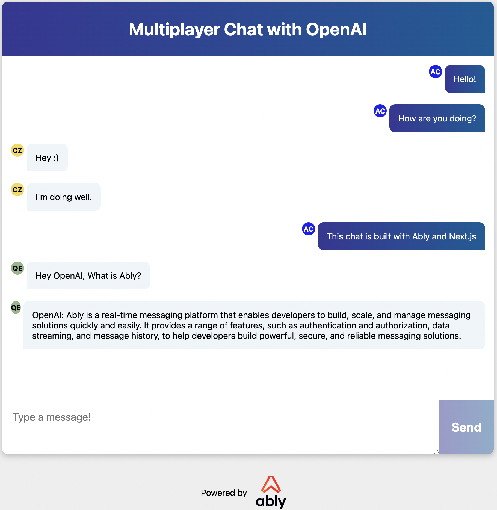
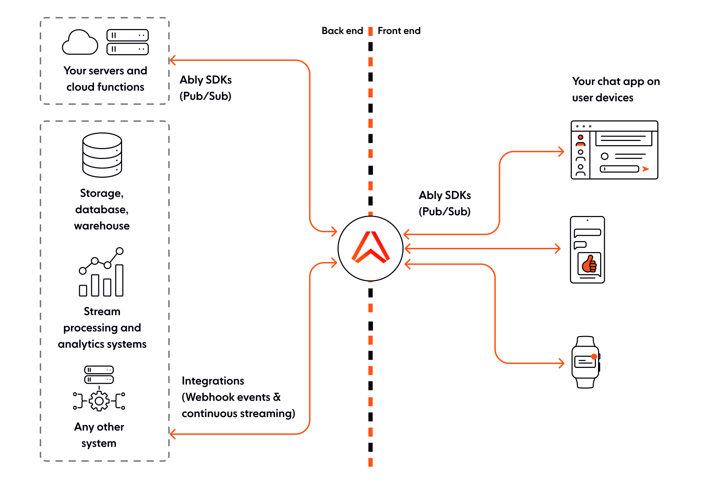

# Group Chat App with OpenAI, Next.js, Ably, and Vercel

https://next-js-chat-app-alpha.vercel.app/

This is a demo of building a chat application with [Next.js](https://nextjs.org/) using Ably as the messaging platform. In addition to the chat functionality, this app incorporates OpenAI's completion API to enhance user experience and provide AI-powered chat assistance.

You'll learn how to - 
* Create a brand new Next.js application
* Create an Ably account and get an API key
* Create a Next.js Vercel Serverless API
* Use React Functional components and React Hooks with Ably
* Integrate OpenAI's completion models into your chat application
* Host your app on Vercel


[Next.js](https://nextjs.org/) is a React framework from [Vercel](https://vercel.com/). It is used to build static web applications with server side rendering, serverless functions and seamless hosting. It's a framework that takes the React knowledge you already have, and puts some structure and conventions in place.

[Ably](https://www.ably.io/) is realtime, pub/sub messaging platform with a suite of integrated services to deliver complete realtime functionality directly to end-users.

[Vercel](https://vercel.com/) is a hosting platform, built from the ground up to host Next.js apps, and Serverless Functions with them.

[React](https://reactjs.org/) is a JavaScript library for building user interfaces with encapsulated components that manage their own state.

[OpenAI](https://www.openai.com/) is an artificial intelligence research lab that develops cutting-edge AI models.

# WebSockets in Vercel with Ably


Vercel allows users to deploy [Serverless Functions](https://vercel.com/docs/serverless-functions/introduction), which are essentially just blocks of code which provide a response to an HTTP request. However, these functions have a maximum execution timeout, which means that it is not possible to maintain a WebSocket connection this way. This is where Ably comes in. The client can connect to an [Ably Channel](https://www.ably.io/documentation/realtime/channels) and send and receive messages on it to add Realtime functionality to your app by managing your WebSocket connections for you. We'll go over how to build an app which uses realtime functionality in this walkthrough, if preferred, you can [jump straight to how to use Ably with Vercel](#ablyandvercel).

# Why Ably

Ably Realtime manages a global transport infrastructure that ensures delivery of messages, with low-latency and high-availability, for a seamless end user experience. Designed for scale, Ably's infrastructure simplifies applications requiring real-time data exchange. As a fully managed service, with comprehensive documentation, and dedicated support, Ably allows developers to focus on their application's core functionality.

# What are we going to build?


*The UI of the app we'll build with this walkthrough*  

We'll build a realtime chat app that runs in the browser. It will be built upon the Next.js [create-next-app](https://nextjs.org/docs/api-reference/create-next-app) template, it will contain a React component which will use Ably to send and receive messages. We'll also write a two Next.js serverless functions which will be used to connect to Ably and retrieve prompt responses from OpenAI.

# How to prompt OpenAI?

It's as simple as following whatever prompt you want to provide to OpenAI with "Hey OpenAI". So if you want to ask OpenAI about Ably, you would publish the following message into the chat (as shown above):

"Hey OpenAI what is Ably?"

## Dependencies

In order to build this app, you will need:

* **An Ably account** for sending messages: [Create an account with Ably for free](https://www.ably.io/signup).
* **A Vercel Account** for hosting on production: [Create an account with Vercel for free](https://vercel.com/signup).
* **Node 12** (LTS) or greater: [Install Node](https://nodejs.org/en/).
* **An OpenAI account** for accessing openai: [Create an account with OpenAI for free](https://beta.openai.com/signup). Note that while API usage during the trial period is free, you may need to upgrade to a paid plan for continued access.

## Local dev pre-requirements

You'll need an API key from Ably to authenticate with the Ably Service. To get an API key, once you have [created an Ably account](https://www.ably.io/signup):

1. Visit your [app dashboard](https://www.ably.io/accounts/any) and click on "Create New App".
2. Give the new app a name
3. Copy the Private API key once the app has been created. Keep it safe, this is how you will authenticate with the Ably service.

Vercel provides some Next.js command line tools to help us. They don't need to be installed on your system as they're executed using `npx`.

# Building the Realtime Chat App
### To create the starter app:

1. In your terminal, type `npx create-next-app` to create an empty Next.js app.
2. Create a file called `.env` in the root of the directory, this is where we'll put the project's environment variables.
3. Add your Ably and OpenAI API keys to the .env file:
```
ABLY_API_KEY=your-ably-api-key:goes-here
OPENAI_API_KEY=your-openai-api-key:goes-here
```
4. Navigate to your Next.js application directory and type into the console:

```bash
npm run dev
```

The Next.js dev server will spin up and you'll see an empty Next.JS starter app. This is what we'll build our chat app on top of.

# Realtime Pub/Sub messaging with Ably

The chat app we'll build uses [Ably](https://www.ably.io/) for [pub/sub messaging](https://www.ably.io/documentation/core-features/pubsub) between the users. Pub/Sub stands for Publish and Subscribe, and it is a popular pattern used for realtime data delivery. The app will be able to send, or `publish` messages over an [Ably Channel](https://www.ably.io/channels). The clients that use the app will be `subscribed` to the channel and will be able to receive the messages. We'll build a UI to create messages to be sent, and to display messages as they are received.

From an architecture perspective, Ably will serve as the transport layer for all chat messages while the client handles the publishing of messages onto Ably channels and the prompting of OpenAI for the completion request. 



Note - [integration rules and webhooks](https://ably.com/docs/general/integrations) can be used on Ably channels to trigger serverless functions on your backend, as depicted in this diagram. See [this tutorial](https://ably.com/tutorials/reactor-event-aws) as an example.

## Authentication with the Ably service

Vercel Next.js apps don't run traditional "server side code", however, you can add JavaScript files to `/pages/api/*` and the Vercel deployment engine will treat each one as an API endpoint and manage them as serverless functions for you.

For local development, the Next.js tools run these functions in a Node server, so they work as you would expect in your local dev environment. We're going to add a Next.js / Vercel serverless function to the starter code that we created earlier to authenticate our app with Ably, and make it possible to start sending and receiving messages over the Ably service.

## <a name="ablyandvercel">Writing the Serverless function to connect to Ably</a>

You'll need to install the [Ably npm package](https://www.npmjs.com/package/ably/v/1.2.5-beta.1) (it's important you're running Ably 1.2.5+ for this app, for compatibility with Vercel). 

In the terminal, in the root of your new app run:

```bash
npm install ably@1.2.5-beta.1
```

Next, create a file called `./pages/api/createTokenRequest.js` into which add the following code:

```js
// Import Ably SDK
import Ably from "ably/promises";

// Create an async function to handle the request and response
export default async function handler(req, res) {
  try {

    // Instantiate Ably client with API key
    const client = new Ably.Realtime(process.env.ABLY_API_KEY);

    // Generate a token request with a specified client ID
    const tokenRequestData = await client.auth.createTokenRequest({ clientId: 'ably-nextjs-demo' });

    // Respond with the token request data and a 200 status code
    res.status(200).json(tokenRequestData);
  } catch (error) {
    // Log the error to the console
    console.error("Error creating Ably token request:", error);

    // Respond with an error message and a 500 status code
    res.status(500).json({ error: "Failed to create Ably token request" });
  }
}
```

This serverless function uses the Ably SDK to create a `tokenRequest` with your API key. This token will be used later - it allows you to keep your "real" API key safe while using it in the Next.js app. By default, this API is configured to be available on `http://localhost:3000/api/createTokenRequest`
We're going to provide this URL to the Ably SDK in our client to authenticate with Ably.

## Writing the Serverless function to connect query OpenAI</a>

Now, you'll need to install the [OpenAI npm package](https://www.npmjs.com/package/openai)

In the terminal, in the root of your new app run:

```bash
npm install openai
```

Next, create a file called `./pages/api/openai.js` into which add the following code:

```js
// Import the necessary classes from the OpenAI package
import { Configuration, OpenAIApi } from 'openai';

// Create a new Configuration object with the API key from the environment variables
const configuration = new Configuration({
  apiKey: process.env.OPENAI_API_KEY,
});

// Instantiate a new OpenAIApi object with the configuration
const openai = new OpenAIApi(configuration);

// Define the default export as an asynchronous function handling an HTTP request and response
export default async (req, res) => {
  try {
    const { prompt } = req.body;

    const completion = await openai.createCompletion({
      model: "text-davinci-003",
      prompt: prompt,
      temperature: 0.6,
      max_tokens: 100, //NOTE: increasing this allows the requrest to have more characters
    });

    // Get the first choice's text from the completion response
    const openaiResponse = completion.data.choices[0].text;

    res.status(200).json({ response: openaiResponse });
  } catch (error) {
    console.error('Error fetching openai response:', error);
    res.status(500).json({ error: `Error fetching openai response: ${error.message}`, details: error });
  }
};
```

This serverless function instantiates a new OpenAIApi object, calls the createCompletion method with data passed to it from the request body, and returns the response from OpenAI.

An important callout here is the max_tokens parameter. OpenAI explains that [tokens](https://help.openai.com/en/articles/4936856-what-are-tokens-and-how-to-count-them) are a way to control the length of completion from OpenAI models. There are set number of tokens on free accounts so be sure to set this parameter according to your needs.

To get additional context on how tokens stack up, consider this:

Wayne Gretzky’s quote "You miss 100% of the shots you don't take" contains 11 tokens.

OpenAI’s charter contains 476 tokens.

The transcript of the US Declaration of Independence contains 1,695 tokens.

# The Realtime Chat App Architecture

The topology of our Next.js app should now look like this:

```bash
├─ .env
├─ .gitignore
├─ package-lock.json
├─ package.json
├─ README.md   
|    
├─── components
│     ├─ AblyChatComponent.jsx
│     ├─ AblyChatComponent.module.css
│     └─ AblyReactEffect.js
|
├─── pages
│    ├─ index.js
│    │   
│    └─── api
│          └─ createTokenRequest.js
│          └─ openai.js
│           
└─── public
```

* `/pages/index.js` is the home page
* `/api/createTokenRequest.js` is our Ably token authentication API / serverless function
* `/api/openai.js` is our OpenAI Completion API / serverless function
* `/components/AblyChatComponent.jsx` is the chat component
* `/components/AblyChatComponent.module.css` contains the styles for the chat component
* `/components/AblyReactEffect.js` is the Ably React Hook.

Let's walk through how this application is built.

# Building the Components

Pages in `Next.js` are React components, so the `pages/index.js` home page is the React component that contains the page layout.

Lets replace the default page generated by `create-next-app`, with our:

```jsx
import Head from 'next/head'
import dynamic from 'next/dynamic'

const AblyChatComponent = dynamic(() => import('../components/AblyChatComponent'), { ssr: false });

export default function Home() {
  return (
    <div className="container">
      <Head>
        <title>Realtime Chat App with Ably, NextJS and Vercel</title>
        <link rel="icon" href="https://static.ably.dev/motif-red.svg?nextjs-vercel" type="image/svg+xml" />
      </Head>

      <main>
        <h1 className="title">Group Chat with OpenAI</h1>
        <AblyChatComponent />
      </main>

      <footer>
        Powered by
        <a href="https://vercel.com" target="_blank" rel="noopener noreferrer">
          
        </a>
        and
        <a href="https://ably.com" rel="noopener noreferrer">
          
        </a>
        <a href="https://github.com/ably-labs/NextJS-chat-app" className="github-corner" aria-label="View source on GitHub">
          <svg width="80" height="80" viewBox="0 0 250 250" className="svg" aria-hidden="true">
            <path d="M0,0 L115,115 L130,115 L142,142 L250,250 L250,0 Z"></path>
            <path d="M128.3,109.0 C113.8,99.7 119.0,89.6 119.0,89.6 C122.0,82.7 120.5,78.6 120.5,78.6 C119.2,72.0 123.4,76.3 123.4,76.3 C127.3,80.9 125.5,87.3 125.5,87.3 C122.9,97.6 130.6,101.9 134.4,103.2" fill="currentColor" className="octo-arm"></path><path d="M115.0,115.0 C114.9,115.1 118.7,116.5 119.8,115.4 L133.7,101.6 C136.9,99.2 139.9,98.4 142.2,98.6 C133.8,88.0 127.5,74.4 143.8,58.0 C148.5,53.4 154.0,51.2 159.7,51.0 C160.3,49.4 163.2,43.6 171.4,40.1 C171.4,40.1 176.1,42.5 178.8,56.2 C183.1,58.6 187.2,61.8 190.9,65.4 C194.5,69.0 197.7,73.2 200.1,77.6 C213.8,80.2 216.3,84.9 216.3,84.9 C212.7,93.1 206.9,96.0 205.4,96.6 C205.1,102.4 203.0,107.8 198.3,112.5 C181.9,128.9 168.3,122.5 157.7,114.1 C157.9,116.9 156.7,120.9 152.7,124.9 L141.0,136.5 C139.8,137.7 141.6,141.9 141.8,141.8 Z" fill="currentColor" className="octo-body"></path></svg>
            </a>
      </footer>

      <style jsx>{`
        .container {
          display: grid;
          grid-template-rows: 1fr 100px;
          min-height: 100vh;
          background-color: #eee;
        }

        main {
          display: grid;
          grid-template-rows: auto 1fr;
          width: calc(100% - 40px);
          max-width: 900px;
          margin: 20px auto;
          border-radius: 10px;
          overflow: hidden;
          box-shadow: 0px 3px 10px 1px rgba(0,0,0,0.2);
          background-color: white;
        }

        .title {
          display: flex;
          justify-content: center;
          align-items: center;
          height: 100px;
          margin: 0;
          color: white;
          background: #005C97;
          background: -webkit-linear-gradient(to right, #363795, #005C97);
          background: linear-gradient(to right, #363795, #005C97);
        }

        footer {
          display: flex;
          justify-content: center;
          align-items: center;
          flex-wrap: wrap;
          width: 100vw;
          height: 100px;
        }

        .logo {
          display: block;
          height: 20px;
          margin: 0.5em;
        }

        .svg { 
          fill:#005C97; 
          color:#fff; 
          position: absolute; 
          top: 0; 
          border: 0; 
          right: 0; 
        }

        .octo-arm {
          transform-origin: 130px 106px;
        }

        .github-corner:hover .octo-arm {
          animation: octocat-wave 560ms ease-in-out;
        }
        
        @keyframes octocat-wave {
          0%, 100%{transform:rotate(0)}
          20%,60%{transform:rotate(-25deg)}
          40%,80%{transform:rotate(10deg)}}
        }

        @media (min-width: 600px) {
          .logo {
            height: 40px;
            margin: 1em;
          }
  
          .ably {
            height: 60px;
          }
        }
       
      `}</style>

      <style jsx global>{`
        html,
        body {
          padding: 0;
          margin: 0;
          font-family: -apple-system, BlinkMacSystemFont, Segoe UI, Roboto,
            Oxygen, Ubuntu, Cantarell, Fira Sans, Droid Sans, Helvetica Neue,
            sans-serif;
        }

        * {
          box-sizing: border-box;
        }

        [data-author="me"] {
          background: linear-gradient(to right, #363795, #005C97); /* W3C, IE 10+/ Edge, Firefox 16+, Chrome 26+, Opera 12+, Safari 7+ */
          color: white;
          align-self: flex-end;
          border-bottom-right-radius: 0!important;
          border-bottom-left-radius: 10px!important;
        }
      `}</style>
    </div>
  )
}
```

You'll notice that AblyChatComponent doesn't look like a regular import - we're including it like this:

```jsx
const AblyChatComponent = dynamic(() => import('../components/AblyChatComponent'), { ssr: false });
```

before using it like any other react component:

```jsx
<main>
  <h1 className="title">Group Chat with OpenAI</h1>
  <AblyChatComponent />
</main>
```

This unusual include style is because the `AblyChatComponent` can only be run inside the user's browser. It connects using WebSockets and isn't suitable for Server Side Rendering with Vercel. By default, Next.js attempts to render everything on the server side, so by including the component using a `dynamic()` call, we can tell Next.js not to render this during the build process, where it would throw errors because it can't connect to the APIs that it needs to function.

# Writing the Chat Component Logic

The chat app logic is contained inside the `AblyChatComponent.jsx` component.

Start off by referencing the imports we'll need at the top of the file:

```jsx
import React, { useEffect, useState } from 'react';
import { useChannel } from "./AblyReactEffect";
import styles from './AblyChatComponent.module.css';
```

Then we'll define the function that will be exported as a React Functional component. We need to access some HTML elements in the code so we can create variables to store their references:

```jsx
const AblyChatComponent = () => {

  let inputBox = null;
  let messageEnd = null;
```

Next, set up the state properties that we'll use in the component:

```jsx
  // State for user input, received messages, and OpenAI response fetching status.
  const [messageText, setMessageText] = useState("");
  const [receivedMessages, setMessages] = useState([]);
  const [fetchingopenaiResponse, setFetchingopenaiResponse] = useState(false);

  // Check if message text is empty (whitespace only).
  const messageTextIsEmpty = messageText.trim().length === 0;

  // Generate a random user color and initials.
  const [userColor, setUserColor] = useState(
    "#" + Math.floor(Math.random() * 16777215).toString(16)
  );
  const [userInitials, setUserInitials] = useState(generateRandomInitials());
```

* **messageText** will be bound to textarea element where messages can be typed
* **receiveMessages** to the on screen chat history
* **setFetchingopenaiResponse** A boolean state variable that indicates whether the openai response is being fetched or not. This is used to display a loading indicator or handle any UI changes during the API call.
* **messageTextIsEmpty** is used to disable the send button when the textarea is empty
* **setUserColor** is used to create a unique banner color for the user
* **setUserInitials** is used to create a random two letter initial combination for a user

Then we set up the functions to ensure the initials color and banner color don't clash

```jsx
  // generate a random set of initials
  function generateRandomInitials() {
    const chars = "ABCDEFGHIJKLMNOPQRSTUVWXYZ";
    const firstInitial = chars[Math.floor(Math.random() * chars.length)];
    const secondInitial = chars[Math.floor(Math.random() * chars.length)];
    return firstInitial + secondInitial;
  }

  // ensure color contrast of fake initials and background look good
  function getContrastTextColor(color) {
    const hexColor = color.replace("#", "");
    const red = parseInt(hexColor.substr(0, 2), 16);
    const green = parseInt(hexColor.substr(2, 2), 16);
    const blue = parseInt(hexColor.substr(4, 2), 16);
    const brightness = (red * 299 + green * 587 + blue * 114) / 1000;
    return brightness > 128 ? "black" : "white";
  }
```


Now we'll make use of the `useChannel` hook that we imported earlier.

`useChannel` is a [react-hook](https://reactjs.org/docs/hooks-intro.html) style API for subscribing to messages from an Ably channel. You provide it with a channel name and a callback to be invoked whenever a message is received.

```jsx
  // Initialize channel, subscribe to messages, and update received messages.
  const [channel, ably] = useChannel("chat-demo", (message) => {
    const history = receivedMessages.slice(-199);
    setMessages([...history, message]);
  });
```

Here we're computing the state that'll be drawn into the message history. We do that by slicing the last 199 messages from the receivedMessages buffer. Then finally, we take the message history, and combine it with the new message. This means we'll always have up to 199 message + 1 new message, stored using the setMessages react useState hook

Now lets check the [channel history](https://ably.com/docs/realtime/history?lang=nodejs) for the chat so that previously published messages are populated in the chat window. 

```jsx
  // Fetch chat history on component mount.
  useEffect(() => {
    const fetchChannelHistory = async () => {
      try {
        const historyPage = await channel.history({ limit: 20 });
        const historyMessages = historyPage.items.reverse();
        setMessages(receivedMessages => [...receivedMessages, ...historyMessages]);
      } catch (error) {
        console.error('Error fetching channel history:', error);
      }
    };

    fetchChannelHistory();
  }, [channel]);
```

Our next step is to determine if a message submitted by the user is an OpenAI prompt that needs to be sent to OpenAI.

```jsx
  // Determine if a message should trigger an OpenAI response.
  const isopenaiTrigger = (message) => {
    return message.startsWith("Hey OpenAI");
  };

  // Send an OpenAI response.
  const sendopenaiResponse = async (messageText) => {
    try {
      setFetchingopenaiResponse(true);

      const response = await fetch('/api/openai', {
        method: 'POST',
        body: JSON.stringify({ prompt: messageText }),
        headers: { 'Content-Type': 'application/json' },
      });

      if (!response.ok) {
        throw new Error(`API request failed with status ${response.status}`);
      }

      const data = await response.json();

    // Extract the openaiResponse from the data object
    const openaiResponse = "OpenAI: " + data.response;
  
    channel.publish({
      name: "chat-message",
      data: { text: openaiResponse, color: userColor, initials: userInitials },
    });
  } catch (error) {
    console.error("Error fetching openai response:", error);
  
  } finally {
    setFetchingopenaiResponse(false);
  }
};
  // Send a chat message and trigger OpenAI response if applicable.
  const sendChatMessage = async (messageText) => {
    // Publish the original message to the channel first.
    channel.publish({
      name: "chat-message",
      data: { text: messageText, color: userColor, initials: userInitials },
    });

    if (isopenaiTrigger(messageText)) {
      await sendopenaiResponse(messageText, userColor);
    }

    setMessageText("");
    if (inputBox) {
        inputBox.focus();
    }
};
```

After this, we need to create some event handlers to send chat messages. The `handleFormSubmission`, is triggered when the `submit` button is clicked and calls `sendChatMessage`, along with preventing a page reload. The `handleKeyUp` event is wired up to ensure that submissions of text call `sendChatMessage`.

```jsx
  // Handle form submission and send a chat message.
  const handleFormSubmission = (event) => {
    event.preventDefault();
    sendChatMessage(messageText);
  };

  // Handle the Enter key and send a chat message.
  const handleKeyUp = (event) => {
    if (event.key !== 'Enter' || messageTextIsEmpty) {
      return;
    }
    sendChatMessage(messageText);
    event.preventDefault();
  };
```

Next, we need to construct the UI elements to display the messages, including OpenAI responses. To do this, we will map the received Ably messages into HTML span elements:

In this updated code, we first identify the author of the message by comparing the message.connectionId with ably.connection.id. If they match, the author is "me" (the current user); otherwise, it's "other" (another user).

Based on whether the message is a OpenAI response or not, we assign the appropriate CSS class to the className variable. For OpenAI messages, we use the styles.openaiMessage class, and for regular messages, we use the styles.message class.

Finally, we return a span element with the determined key, className, and data-author attributes, and display the message content using {message.data}.


```jsx
  // Render messages and handle OpenAI responses.
  const messages = receivedMessages.map((message, index) => {
  const author = message.connectionId === ably.connection.id ? "me" : "other";
  const isGPTMessage = message.data.text.startsWith("openai: ");
  const textColor = getContrastTextColor(message.data.color);
  const className = `${isGPTMessage ? styles.openaiMessage : styles.message} ${author === "me" ? styles.messageSentByMe : styles.messageSentByOthers}`;


  // Set the font color based on the message author.
  const fontColor = author === "me" ? "#FFFFFF" : "#000000";

  // Set the alignment based on the message author.
  const justifyContent = author === "me" ? "flex-end" : "flex-start";

  return (
    <div
      key={index}
      className={`${styles.messageWrapper} ${author === "me" ? styles.messageSentByMe : styles.messageSentByOthers}`}
      style={{ justifyContent: justifyContent }}
    >
      <div
        className={styles.colorSquare}
        style={{ backgroundColor: message.data.color, color: textColor }}
      >
        {author === "me" ? userInitials : message.data.initials}
      </div>
      <span
        className={className}
        data-author={author}
        style={{ color: fontColor }}
      >
        {message.data.text}
      </span>
    </div>
  );
});

  // Scroll to the most recent message.
  useEffect(() => {
    messageEnd?.scrollIntoView({ behavior: "smooth" });
  });

  // Render the chat interface.
  return (
    <div className={styles.chatHolder}>
      <div className={styles.chatText}>
        {messages}
        {fetchingopenaiResponse && (
          <span className={styles.fetchingMessage}>
            Fetching response from OpenAI...
          </span>
        )}
        <div ref={(element) => { messageEnd = element; }}></div>
      </div>
      <form onSubmit={handleFormSubmission} className={styles.form}>
        <textarea
          ref={(element) => { inputBox = element; }}
          value={messageText}
          placeholder="Type a message!"
          onChange={e => setMessageText(e.target.value)}
          onKeyUp={handleKeyUp}
          className={styles.textarea}
        ></textarea>
        <button type="submit" className={styles.button} disabled={messageTextIsEmpty}>Send</button>
      </form>
    </div>
  )
}
export default AblyChatComponent;
```

Right at the bottom of the file, the function is exported as `AblyChatComponent` so that it can be referenced in the Next.js page we created at the start.

## Use a Vercel Lambda to query OpenAI

Now we need to define a serverless function for our Next.js application that communicates with the OpenAI API to generate text completions using an openai model. It extracts a prompt from the request body, sends it to the API, and returns the generated text in a JSON response. In case of errors, it logs the error message and sends a JSON response with the error details and a 500 status code.

```jsx
// Import the necessary classes from the OpenAI package
import { Configuration, OpenAIApi } from 'openai';

// Create a new Configuration object with the API key from the environment variables
const configuration = new Configuration({
  apiKey: process.env.OPENAI_API_KEY,
});

// Instantiate a new OpenAIApi object with the configuration
const openai = new OpenAIApi(configuration);

// Define the default export as an asynchronous function handling an HTTP request and response
export default async (req, res) => {
  try {
    const { prompt } = req.body;

    const completion = await openai.createCompletion({
      model: "text-davinci-003",
      prompt: prompt,
      temperature: 0.6,
    });

    // Get the first choice's text from the completion response
    const openaiResponse = completion.data.choices[0].text;

    res.status(200).json({ response: openaiResponse });
  } catch (error) {
    console.error('Error fetching openai response:', error);
    res.status(500).json({ error: `Error fetching openai response: ${error.message}`, details: error });
  }
};
```

## Using Ably correctly in React Components

One of the trickier parts of using Ably with React Functional Components is knowing when and where to create the instance of the SDK and when and where to connect to your channel(s). You will want to avoid instancing the SDK when the component is rendered as this could make multiple connections and burn through your Ably account limits.

To make sure that the app handles component redrawing, mounting and unmounting correctly - `AblyReactEffect` exports a [React Hook](https://reactjs.org/docs/hooks-intro.html) to interact with the Ably SDK.

React hooks can seem a little unusual the first time you use them. A hook is a function which:

* Executes the functionality that we'd expect `componentDidMount` to run
* Returns *another* function that will be executed by the framework where `componentDidUnmount` would be called
* Performs any other behaviour it needs to

This React Hook is built upon `useEffect`. When referenced, it creates an instance of the Ably SDK (it does this only once) which is configured to use the `URL` of your Serverless function to `createTokenRequest` for authentication:

```js
import Ably from "ably/promises";

// Create an async function to handle the request and response
export default async function handler(req, res) {
  try {

    // Instantiate Ably client with API key
    const client = new Ably.Realtime(process.env.ABLY_API_KEY);

    // Generate a token request with a specified client ID
    const tokenRequestData = await client.auth.createTokenRequest({ clientId: 'ably-nextjs-demo' });

    res.status(200).json(tokenRequestData);
  } catch (error) {
    console.error("Error creating Ably token request:", error);

    res.status(500).json({ error: "Failed to create Ably token request" });
  }
}
```

Instancing the Ably library outside the scope of the component will mean it is only created once and will keep your limit usage down.

We then need to create the function we're going to export - our custom Hook, so that we can use it in our components.
We'll call it useChannel and it will require the channel name, and a callback as arguments. Each time useChannel is called, we get the requested channel from the Ably-JS SDK and prepare the hook functions. Additionally, we create a separate channel for openai messages.

* **onMount** is the code run each time our component is rendered. Inside onMount, we will subscribe to the specified chat channel, triggering `callbackOnMessage` whenever a message is received. We also subscribe to the openai channel, fetch the response, and call the provided callback with the response.
* **onUnmount** is the code run whenever the component is unmounted before it is re-rendered. Here we will unsubscribe from both the chat channel and openai channel, which will stop accidental multiples of connections, again saving our account limits.
* **useEffectHook** is a function that calls these functions correctly, returning onUnmount for React to use.

The exported Hook in `AblyReactEffect.js` will look like this: 

```js
import Ably from "ably/promises";
import { useEffect } from 'react'

const ably = new Ably.Realtime.Promise({ authUrl: '/api/createTokenRequest' });

export function useChannel(channelName, callbackOnMessage) {
    const chatChannel = ably.channels.get(channelName);
  
    const onMount = () => {
      chatChannel.subscribe(msg => { callbackOnMessage(msg); });
    }
  
    const onUnmount = () => {
      chatChannel.unsubscribe();
    }
  
    const useEffectHook = () => {
      onMount();
      return () => { onUnmount(); };
    };
  
    useEffect(useEffectHook);
  
    return [chatChannel, ably];
  
```

The `useChannel` Hook returns both the current Ably channel and the Ably SDK for the calling code to use to send messages. This hook encapsulates Ably pub/sub for React functional components in one place, so we don't need to worry about it elsewhere, and the code that uses it can just process the messages it receives.

## Making everything look beautiful with module CSS - `AblyChatComponent.module.css`

You might have noticed when writing the chat component that `Next.js` has some compiler enforced conventions that dictate where you keep your CSS and how to import it.
For this app, we will create a CSS file with the same name as the `.jsx` file, just with the extensions `.module.css`. We do this to keep management of the components easier, if in the future we want to delete this component it is nice and simple to also remove its CSS. Once created, it can be imported into the component:

```js
import styles from './AblyChatComponent.module.css';
```

When creating a CSS class on a JSX element, we use the following syntax on the element:

```js
 className={styles.yourClassName}
```

and the accompanying css would look like this: 

```css
.yourClassName {
  styles: gohere;
}
```
This app is built with [CSS Grid](https://css-tricks.com/snippets/css/complete-guide-grid/) to create the app layout, you are of course welcome to use the CSS provided with this project or to write your own or use a framework.

# Hosting on Vercel

We're using `Vercel` as our development server and build pipeline.

> The easiest way to deploy Next.js to production is to use the Vercel platform from the creators of Next.js. Vercel is an all-in-one platform with Global CDN supporting static & Jamstack deployment and Serverless Functions.
<cite>-- [The Next.js documentation](https://nextjs.org/docs/deployment)</cive>

In order to deploy your new chat app to Vercel you'll need to:

1. Create a [GitHub account](https://github.com/) (if you don't already have one)
2. [Push your app to a GitHub repository](https://docs.github.com/en/free-pro-team@latest/github/creating-cloning-and-archiving-repositories/creating-a-new-repository)
3. [Create a Vercel account](https://vercel.com/signup)
4. Create a new Vercel app and import your app from your GitHub repository. (This will require you to authorise Vercel to use your GitHub account)
5. Add your `ABLY_API_KEY` and `OPENAI_API_KEY` as environment variables
6. Watch your app deploy
7. Visit the newly created URL in your browser!

